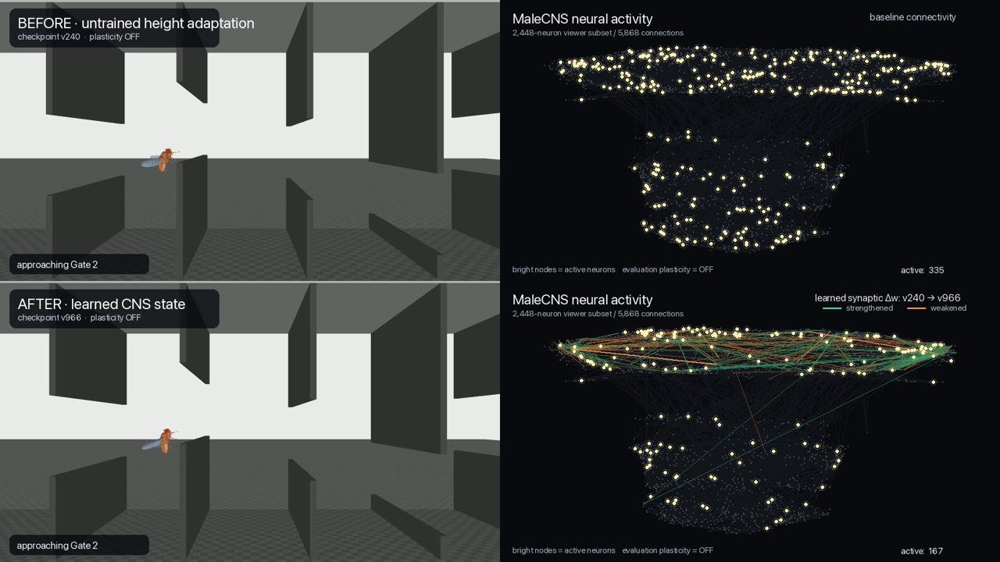

# virtual-fly

[English](README.md) · [日本語](README.ja.md) · [简体中文](README.zh-CN.md)

`virtual-fly` は、成体オスのショウジョウバエ（*Drosophila melanogaster*）の公開MaleCNSコネクトームを初期状態として、神経活動・神経修飾・局所シナプス可塑性を時間発展させ、FlyBody / MuJoCoの身体と物理環境へ閉ループ接続する研究プロジェクトです。

これは「ハエのコネクトームを使って人工ニューラルネットワークを学習する」プロジェクトではありません。現行production pathでは、誤差逆伝播、勾配降下、Q-learning、policy gradient、外部ニューラルネットワークcontroller、障害物攻略ロジックを使用しません。学習に相当するweight変化は、局所神経活動、eligibility、ドーパミン作動性神経修飾によって神経runtime内部で生じます。

> **現在の状態:** canonical experiment v1とend-to-end再現スクリプトは完成済みです。canonical runでは、現行コードの完全な来歴を持つ実行経路と、局所可塑性によるMaleCNS保存weightの変化を確認しました。一方、この短いcanonical runでは**カテゴリカルな行動改善は確認されませんでした**。

## Canonical result

公開時の基準結果は [`canonical/canonical-v1/`](canonical/canonical-v1/README.md) です。過去の開発系統とは意図的に分離されています。

| 項目 | Canonical v1 |
|---|---|
| 科学実行コード | `7fa464aad7269d34f46f1171080b51e095d1d811`（clean） |
| MaleCNS snapshot | 166,700 neurons / 25,582,938 directed edges |
| DAN semantics | 公開annotation `class=DAN` + dopamine consensus、338 modulators |
| Body / environment | v7 / v7 |
| Vision | direct-ray、13 rays/ommatidium |
| Haltere input | 97-neuron timing subset、gain `0.05`、`interaction-load-v2` |
| Training | 6 episodes、population 2、async shared weights、boundary-band |
| Global weight version | v0 → v6 |
| Aggregate neural step | 484 |
| 厳密に値が変化した保存edge | 2,163,179 |
| Frozen initial evaluation | 1 gate通過後、control step 120でgate collision |
| Frozen final evaluation | 1 gate通過後、control step 120でgate collision |

Frozen evaluationではplasticityと課題イベント由来のDAN刺激を両方停止しています（`reward_current=0`, `aversive_current=0`）。したがってcanonical v1が示しているのは、**現行の局所可塑性意味論で保存weightが変化したこと**であり、行動改善・一般化・長期学習安定性の実証ではありません。

2026-09-19にcleanな`7fa464a`からend-to-end reproducerを再実行し、source-derived static artifactのhashがすべてreferenceと一致すること、global v6まで学習が完了すること、厳密に2,163,179 edgeが変化すること、initial/final checkpointが再ロードできること、frozen evaluation結果がreferenceと一致することを確認しています。

詳細:

- [`canonical/canonical-v1/reference-report.md`](canonical/canonical-v1/reference-report.md) — canonical結果の短い要約
- [`canonical/canonical-v1/reference-manifest.json`](canonical/canonical-v1/reference-manifest.json) — 完全なprovenance
- [`docs/results.ja.md`](docs/results.ja.md) — canonicalとhistorical resultの境界
- [`docs/reproducibility-fixes-2026-09-19.md`](docs/reproducibility-fixes-2026-09-19.md) — provenance / semantics監査と修正

## Historical visualization



上の画像は投稿用に作成した**historical** Before/After可視化（`v240 → v966`）の1フレームです。身体と神経viewerの閉ループを視覚的に示すには有用ですが、**canonical experimentの証拠ではありません**。v240/v960/v966/v1704は現在のcanonicalとは来歴が異なり、一部は意味論も異なります。

完全な動画とraw playbackは巨大Git blobとしてcommitせず、明示的にhistoricalとラベル付けしたGitHub Release assetとして配布する設計です。assetのhashとprovenanceは [`release/release-assets-v0.1.0.json`](release/release-assets-v0.1.0.json) に記録します。

## 現在実装されているもの

現行production pathは次です。

```text
Flyppy physical world
        ↓
FlyBody compound-eye geometry + local direct rays
        ↓
released MaleCNS R1-R6 body-ID currents
        ↓
whole-MaleCNS neural dynamics
        ↓
local eligibility + class-DAN-mediated plasticity
        ↓
individual released motor-neuron spikes
        ↓
whole-body peripheral muscle state
        ↓
FlyBody / MuJoCo physical actuation
        ↓
Flyppy physical world
```

ゲート通過や衝突などの課題イベントが直接weightを書き換えることはありません。イベントは選択された実在DAN群への電流刺激へ変換され、その後のシナプス変化は神経runtime内の局所則で計算されます。

現在の重要な境界:

- MaleCNS source snapshotはimmutableです。
- 視覚入力は外部obstacle classifierを使わず、局所retinotopic R1-R6 identityを維持します。
- 運動出力はpopulation average action decoderではなく、個別released motor-neuron IDを維持します。
- viewerはobserver-onlyで、trainingへ状態を返しません。
- population trainingは1つのglobal weight stateを共有しますが、episode-localな膜電位・spike・refractory・trace・modulation・eligibilityはepisode間でresetされます。
- 現在のpopulation checkpointはglobal weightsを保存し、完全な持続的生物個体状態を保存するものではありません。

実装詳細は [`docs/architecture.ja.md`](docs/architecture.ja.md) と [`docs/code-structure.md`](docs/code-structure.md) を参照してください。

## このプロジェクトが主張していないこと

`virtual-fly` は生物学的根拠を持つ計算上の再構築であり、現時点で完全な生物学的ハエを再現したという主張ではありません。

特にcanonical v1は以下を実証していません。

- 6 episode後のカテゴリカルな行動改善
- 課題一般化
- 長期的な学習安定性
- 全ニューロン、全シナプス、全感覚器、全飛翔筋の完全な生物物理忠実性
- historical v240/v960/v966/v1704結果と現行canonical semanticsの同一性

可能な限り、upstreamで観測された値、文献由来の値、推定、工学的仮定、calibrationを区別します。

## Installation

### 必要環境

- Python `>=3.12,<3.15`
- [`uv`](https://docs.astral.sh/uv/)
- Rust toolchain / Cargo
- MuJoCoを実行できるローカル環境

現在のcanonical referenceはmacOS / Apple Metal GPU上で生成されています。source-derived static artifactはhashで照合しますが、async GPU/MuJoCo trajectoryが異なるhardware間でbit-identicalになることは保証していません。

```bash
git clone https://github.com/shute2004/virtual-fly.git
cd virtual-fly
uv sync --frozen
```

大容量upstream datasetや生成experiment artifactは意図的にGitへ含めません。

## Canonical v1を再現する

canonical reproducerは、official sourceのfresh取得、snapshot/derived artifact再生成、6 episode canonical training、initial/final checkpoint検証、frozen evaluation、provenance manifest生成までを一括実行します。

```bash
bash canonical/canonical-v1/reproduce.sh
```

巨大output bundleは既定でrepository外へ出ます。

```text
${XDG_CACHE_HOME:-$HOME/.cache}/virtual-fly/reproductions/
```

別の保存先は`VF_CANONICAL_OUTPUT_ROOT=/path/to/output`で指定できます。科学実行部分は常にcleanな`7fa464a`へ固定したisolated worktreeで実行されます。

## 現行development training

現在の汎用production entry pointは次です。

```bash
bash scripts/dev/train_flyppy_population.sh
```

`scripts/dev/train_flyppy_v3_population.sh`はcompatibility wrapperとして残っています。development runや継続更新reportは、自動的にcanonical resultになるわけではありません。

## Repository構成

```text
canonical/      canonical experiment packageとreference provenance
crates/         Rust neural runtime / runner
docs/           architecture、科学契約、再現性、履歴資料
reports/        小容量の診断・historical development report
scripts/        data preparation、analysis、compatibility CLI、launcher
src/            現行Python package (`virtual_fly`)
tests/          semantics / scheduling / runtime / reproducibility test
visualization/  observer-only neural viewer
artifacts/      ローカル大容量data/checkpoint/video。Git対象外
release/        release asset manifest。大容量本体はGit対象外
```

ドキュメント案内は [`docs/README.ja.md`](docs/README.ja.md) を参照してください。

## 結果・provenance・大容量data

historical development resultは来歴として有用なので残していますが、canonicalへ遡及的に読み替えません。境界は [`docs/results.ja.md`](docs/results.ja.md) に明記しています。

MaleCNS raw、snapshot、checkpoint、trajectory、rendered video、build cache等の巨大ファイルはGitから除外し、小さなmanifest・hash・reportを追跡します。

## Citation

引用情報は [`CITATION.cff`](CITATION.cff) にあります。アーカイブ用GitHub Releaseはpublication branch上のtagから作成し、Zenodoへ連携する設計です。詳細は [`docs/release-and-zenodo.md`](docs/release-and-zenodo.md) を参照してください。

## License

`virtual-fly`独自のsource codeとdocumentationは [MIT License](LICENSE) です。外部dataset、software、model asset、第三者materialを含むgenerated mediaはそれぞれの利用条件に従います。詳細は [`THIRD_PARTY_NOTICES.md`](THIRD_PARTY_NOTICES.md) を参照してください。
