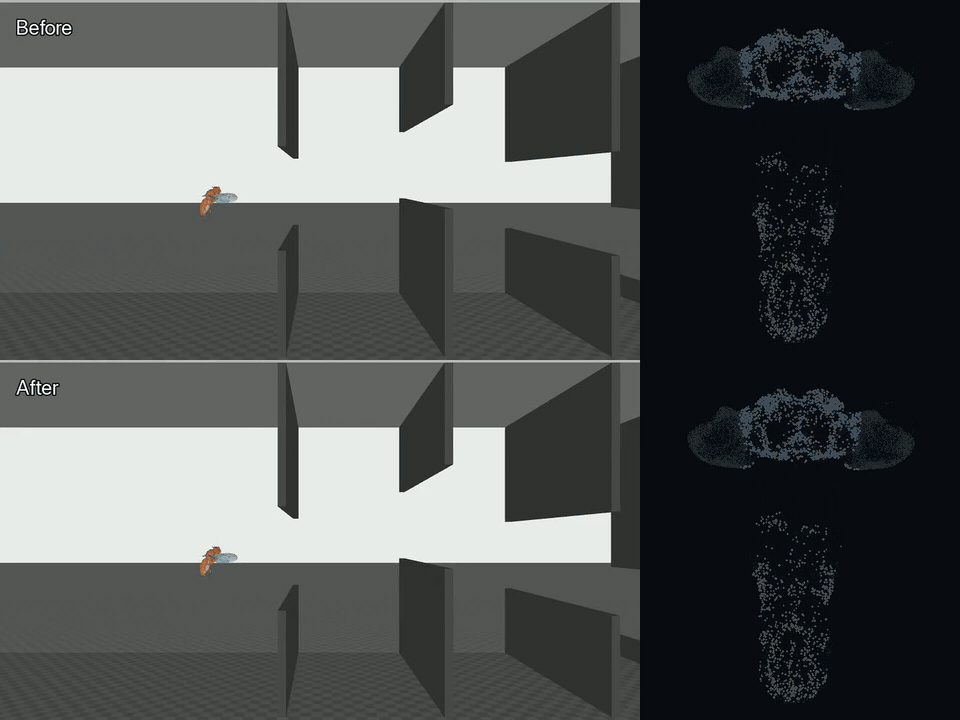

# virtual-fly

[English](README.md) · [日本語](README.ja.md) · [简体中文](README.zh-CN.md)

`virtual-fly` は、成体オスのショウジョウバエの公開MaleCNSコネクトームを初期状態として、神経活動・神経修飾・局所シナプス可塑性を時間発展させ、FlyBody / MuJoCoの身体と物理環境に閉ループ接続する研究プロジェクトです。

これは「ショウジョウバエのコネクトームを配線として人工ニューラルネットワークを学習させる」プロジェクトではありません。現在の実装では、誤差逆伝播、勾配降下、Q学習、方策勾配、外部ニューラルネットワークによる制御器、障害物を攻略するための手書き規則を使っていません。学習に伴う重みの変化は、局所的な神経活動、適格度、ドーパミン作動性の神経修飾から、神経系の内部で生じます。

> **現在の状態:** 基準実験であるcanonical v1と、その一連の再現スクリプトは完成しています。canonical v1では、現行コードから結果までの来歴を追跡できることと、局所可塑性によってMaleCNSの保存重みが実際に変化することを確認しました。一方、この短い実験では**明確な行動改善は確認されませんでした**。

**科学的参考文献:** [`docs/ja/references.md`](docs/ja/references.md) に、今回の実装で参照した主要な一次論文・公式資料と、それぞれがどの実装判断の根拠になったかをまとめています。

## 過去系統の比較映像



このアニメーションは、過去の`v240 → v966`比較をREADME向けに描画した元動画から作成し、見やすさのため**1.5倍速**にしています。身体運動と神経活動を同時に確認できるため、プロジェクトの内容を視覚的に示す資料として上部に置いています。

ただし、これは**canonical v1の証拠ではありません**。Before側のv240は未学習のMaleCNS初期状態ではなく、すでに240エピソードの学習を経た過去系統のチェックポイントです。再生時は可塑性を停止していましたが、課題イベントに伴うPAM刺激は有効で、ホールドアウト評価でもありません。After側のv966も複数の過去条件が混在した系統であり、canonical v1とは来歴と一部の実行条件が異なります。

Xへ投稿した動画、README GIFの生成に使った元動画、GitHub Releaseに添付予定のMP4は、同じv240/v966比較を別々に描画・変換したファイルであり、同一バイナリではありません。それぞれの役割、解像度、ハッシュ値は [`release/release-assets-v0.1.0.json`](release/release-assets-v0.1.0.json) に分けて記録しています。

## 基準実験（canonical v1）

公開時の基準結果は [`canonical/canonical-v1/`](canonical/canonical-v1/README.md) にまとめています。過去の開発系統とは意図的に分離しています。

| 項目 | canonical v1 |
|---|---|
| 科学計算に使用したコード | `7fa464aad7269d34f46f1171080b51e095d1d811`（変更なしの状態） |
| MaleCNSスナップショット | 166,700ニューロン / 25,582,938有向辺 |
| DANの定義 | 公開注釈`class=DAN`とドーパミン判定の一致、338個 |
| 身体 / 環境 | v7 / v7 |
| 視覚 | `direct-ray`、個眼あたり13本 |
| 平均棍入力 | 97ニューロンの時系列用部分集合、利得`0.05`、`interaction-load-v2` |
| 学習条件 | 6エピソード、同時個体数2、非同期共有重み、`boundary-band` |
| 共有重みの版 | v0 → v6 |
| 神経更新ステップ総数 | 484 |
| 保存重みが実際に変化した辺 | 2,163,179 |
| 初期状態の固定評価 | 1枚通過後、制御ステップ120で次のゲートに衝突 |
| 最終状態の固定評価 | 1枚通過後、制御ステップ120で次のゲートに衝突 |

固定評価では、可塑性と課題イベントによるDAN刺激をどちらも停止しています（`reward_current=0`, `aversive_current=0`）。したがってcanonical v1が示しているのは、**現在の局所可塑性則のもとで保存重みが変化したこと**です。行動改善、一般化、長期的な学習安定性まで実証したものではありません。

2026年9月19日には、変更のない`7fa464a`から一連の再現処理を最初から実行しました。元データから生成される静的成果物のハッシュ値はすべて記録済みの基準値と一致し、学習は共有重みv6まで完了しました。保存重みが変化した辺の数も2,163,179で一致し、初期・最終チェックポイントの再読み込みと固定評価の結果も基準記録と一致しました。

詳細:

- [`canonical/canonical-v1/reference-report.md`](canonical/canonical-v1/reference-report.md) — 基準実験の結果要約
- [`canonical/canonical-v1/reference-manifest.json`](canonical/canonical-v1/reference-manifest.json) — 完全な来歴記録
- [`docs/ja/results.md`](docs/ja/results.md) — 基準結果と過去結果の区別
- [`docs/ja/reproducibility-fixes-2026-09-19.md`](docs/ja/reproducibility-fixes-2026-09-19.md) — 来歴と実行上の意味づけに関する監査・修正記録

## 現在実装されているもの

現在の実行経路は次のとおりです。

```text
Flyppyの物理環境
        ↓
FlyBodyの複眼幾何 + 局所direct-ray
        ↓
公開MaleCNSのR1-R6 body IDへの電流入力
        ↓
MaleCNS全体の神経活動
        ↓
局所適格度 + class-DANによる神経修飾と可塑性
        ↓
公開運動ニューロンごとの発火
        ↓
全身の末梢筋状態
        ↓
FlyBody / MuJoCoによる物理駆動
        ↓
Flyppyの物理環境
```

ゲート通過や衝突などの課題イベントが、重みを直接書き換えることはありません。イベントは選択した実在DAN群への電流刺激へ変換され、その後のシナプス変化は神経系内部の局所則によって計算されます。

現在の重要な境界は次のとおりです。

- MaleCNSの元スナップショットは読み取り専用です。
- 視覚入力では外部の障害物分類器を使わず、R1-R6の局所的な網膜上の位置関係を維持します。
- 運動出力では、集団平均から行動を選ぶ復号器を置かず、公開運動ニューロンごとのbody IDを維持します。
- 可視化画面は観察専用で、学習側へ状態を返しません。
- 並列学習では共有重みを1つ持ちますが、膜電位、発火状態、不応期、活動履歴、神経修飾、適格度などの短期状態はエピソードごとに初期化します。
- 現在の並列学習用チェックポイントが保存するのは共有重みであり、仮想個体の全状態を持続的に保存するものではありません。

実装の詳細は [`docs/ja/architecture.md`](docs/ja/architecture.md) と [`docs/ja/code-structure.md`](docs/ja/code-structure.md) を参照してください。

## このプロジェクトが主張していないこと

`virtual-fly` は、生物学的な根拠に基づいてショウジョウバエを計算機上で再構築しようとする研究です。現在のシミュレーターが、すでに現実のハエを完全に再現しているという主張ではありません。

特にcanonical v1では、次のことは実証していません。

- 6エピソード後の明確な行動改善
- 未経験条件への一般化
- 長期的な学習安定性
- 全ニューロン、全シナプス、全感覚器、全飛翔筋の完全な生物物理学的再現
- 過去のv240 / v960 / v966 / v1704と、現在のcanonical v1が同じ条件・意味づけで得られたということ

可能な限り、上流データで直接観測された値、文献から採用した値、推定値、工学的な仮定、較正値を区別して記録します。

## 導入

### 必要なもの

- Python `>=3.12,<3.15`
- [`uv`](https://docs.astral.sh/uv/)
- Rustの開発環境 / Cargo
- MuJoCoを実行できる環境
- **canonical v1を最初から最後まで再現する場合:** 神経実行系で利用できるwgpu対応GPU

下記の基本検証ではcanonical実験そのものを実行しません。一方、`canonical/canonical-v1/reproduce.sh`による完全再現では、神経実行系の較正処理がGPUを明示的に使用します。現在の基準結果はmacOS / Apple Metal GPU上で生成しています。元データから決定論的に生成される静的生成物はハッシュ値で照合しますが、非同期実行を含むGPU / MuJoCoの軌跡が異なるハードウェア間でビット単位に一致することは保証していません。

```bash
git clone https://github.com/shute2004/virtual-fly.git
cd virtual-fly
uv sync --frozen
```

大容量の外部データや実験生成物は、意図的にGitへ含めません。

### 基本検証

導入後、MaleCNSデータを取得したりcanonical実験全体を実行したりせずに、ソース一式の基本的な健全性を確認できます。

```bash
uv run python -m unittest discover -s tests -v
cargo test --workspace
bash -n canonical/canonical-v1/reproduce.sh
```

最初の2つはPython側の意味づけ・実行制御に関する試験と、Rust製神経実行系の試験です。最後のコマンドはcanonical再現スクリプトを実行せず、シェルの入口が構文上有効であることだけを確認します。

## チェックポイントの配布

チェックポイント本体はGitHubのソースリポジトリには含めません。Hugging Faceには、virtual-flyの概要ページをすでに用意しています。

- [Hugging Face: `shute2004/virtual-fly`](https://huggingface.co/shute2004/virtual-fly)

以下の4つについては公開する内容まで準備済みですが、**リポジトリ自体はまだ作成・公開していません**。GitHubを公開する前に作成し、ファイルとハッシュ値を確認します。

- `virtual-fly-initial-YYYYMMDD` — canonical v1の初期チェックポイント
- `virtual-fly-trained-YYYYMMDD` — canonical v1で6エピソードの学習処理を経たチェックポイント
- `virtual-fly-video-before` — 公開Before / After動画のBefore側に実際に使用した過去系統のチェックポイント
- `virtual-fly-video-after` — 同じ動画のAfter側に実際に使用した過去系統のチェックポイント

日付付きの2リポジトリ名は、実際の公開日にのみ`YYYYMMDD`を確定します。動画用Before / Afterは**canonical v1の初期・学習後チェックポイントとは別系統**です。v240 / v966などの内部番号はリポジトリ名には出さず、来歴情報としてのみ保持します。MaleCNSの生データ、FlyBodyの資産、軌跡一式、全フレーム、無関係な開発途中の成果物は、単に存在するという理由ではHugging Faceへ複製しません。

公開構造、モデルカード雛形、必要ファイル一覧、帰属情報、チェックポイントのハッシュ値は [`release/huggingface/`](release/huggingface/README.md) にまとめています。

## canonical v1を再現する

再現スクリプトは、公式配布元からのMaleCNSデータ新規取得、スナップショットと派生成果物の再生成、6エピソードの基準学習、初期・最終チェックポイントの検証、固定評価、来歴記録の生成までを一括で実行します。

```bash
bash canonical/canonical-v1/reproduce.sh
```

大容量の出力一式は、既定ではリポジトリの外に保存されます。

```text
${XDG_CACHE_HOME:-$HOME/.cache}/virtual-fly/reproductions/
```

保存先は`VF_CANONICAL_OUTPUT_ROOT=/path/to/output`で変更できます。科学計算部分は、常に変更のない`7fa464a`を切り出した独立作業ツリーで実行されます。

## 現在の開発用学習

通常の実行入口は次です。

```bash
bash scripts/dev/train_flyppy_population.sh
```

`scripts/dev/train_flyppy_v3_population.sh`は互換性維持のための呼び出しスクリプトとして残しています。開発中の実行結果や随時更新されるレポートが、自動的に基準結果になるわけではありません。

## リポジトリ構成

```text
canonical/      基準実験パッケージと来歴記録
crates/         Rust製の神経実行系と実行プログラム
docs/           3言語の公開文書（`en/`・`ja/`・`zh-CN/`）、内部文書、履歴資料
reports/        小容量の診断結果と過去の開発レポート
scripts/        データ準備、解析、互換用コマンド、起動スクリプト
src/            現行Pythonパッケージ（`virtual_fly`）
tests/          意味づけ、実行順序、実行系、再現性の試験
visualization/  観察専用の神経可視化
artifacts/      ローカルの大容量データ、チェックポイント、動画。Git管理外
release/        公開用ファイルの来歴記録。大容量ファイル本体はGit管理外
```

文書全体の案内は [`docs/ja/README.md`](docs/ja/README.md) を参照してください。

## 結果・来歴・大容量データ

過去の開発結果は研究の来歴として有用なため残していますが、現在の基準結果として読み替えることはしません。区別は [`docs/ja/results.md`](docs/ja/results.md) に明記しています。

MaleCNSの生データ、スナップショット、チェックポイント、軌跡データ、描画動画、ビルドキャッシュなどの大容量ファイルはGitから除外し、小さな来歴記録、ハッシュ値、設定、レポートだけを追跡します。

## 引用方法

引用情報は [`CITATION.cff`](CITATION.cff) に記載しています。v0.1.0の初回公開ではGitHubとHugging Faceを使用し、Zenodo / DOIは使用しません。将来、固定された学術アーカイブが必要になった場合に改めて検討します。詳細は [`docs/internal/en/release-and-zenodo.md`](docs/internal/en/release-and-zenodo.md) を参照してください。

## ライセンス

`virtual-fly`独自のソースコードと文書は [MIT License](LICENSE) で公開します。外部データ、外部ソフトウェア、外部モデルの資産、第三者由来の素材を含む生成物には、それぞれの利用条件が適用されます。詳細は [`THIRD_PARTY_NOTICES.md`](THIRD_PARTY_NOTICES.md) を参照してください。
